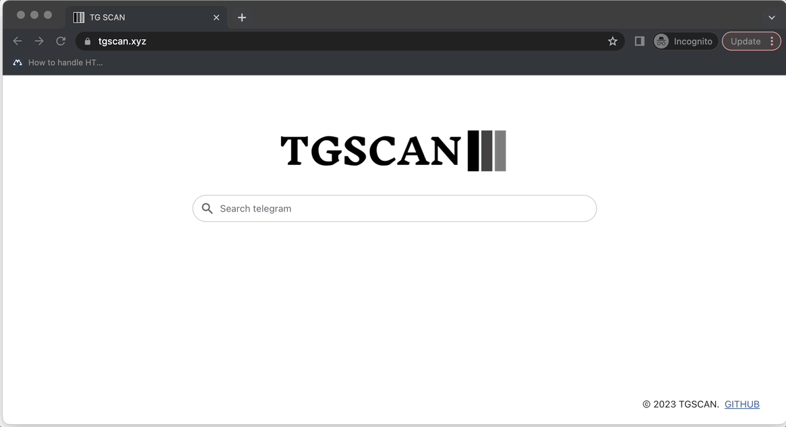

<h1 align="center">

  
 
</h1>

<h4 align="center">Streamline Your Telegram Searches: Find Channels, Groups, and Chat History Effortlessly.</h4>

  English
   | 
  <a href="README_cn.md">中文</a>

<h4 align="center">
  

  

  
</h4>

  <a href="#key-features">Key Features</a> •
  <a href="#how-to-use">How To Use</a> •
  <a href="#credits">Credits</a> •
  <a href="#contribution">Contribution</a> •
  <a href="#license">License</a> •
  <a href="#contact">Contact</a>

 

## Key Features

- Fast search results
- Intuitive search interface
- Ability to search chat history
- Near-real-time indexing for up-to-date search results

## How To Use

To get started, visit [setup.md](setup.md) for detailed setup instructions.

## Credits

This software uses the following open source packages:

- [HanLP](https://github.com/hankcs/HanLP)
- [React](https://github.com/facebook/react)
- [Ramda](https://github.com/ramda/ramda)
- [Polaris](https://github.com/Shopify/polaris)
- [Telethon](https://github.com/LonamiWebs/Telethon)
- [Elasticsearch](https://github.com/elastic/elasticsearch)

## Contribution

Welcome to submit code or any channels that need indexing.

## License

This project is licensed under the GNU License. See the [LICENSE](LICENSE) file for details.

## Contact

 

